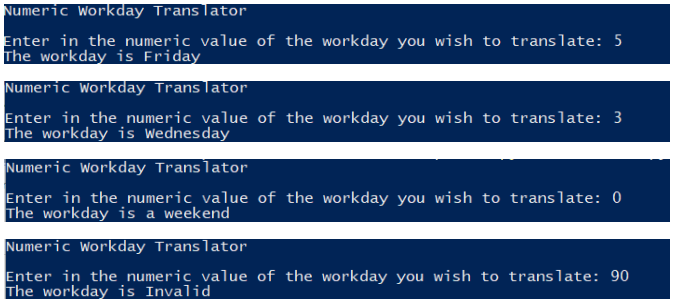

## Chapter 3 - Lab 1 - Workdays

### Instructions:
- Create a Python program that does the following 
  - Prompts the user asking them to enter in the numeric value of a workday (1 = Monday, 2 = Tuesday, 3 = Wednesday, 4 = Thursday, 5 = Friday) 
  - Displays the appropriate workday entered 
  - Displays that a weekend day was entered if the values 0, 6 or 7 are entered 
  - Displays an appropriate error message if any value other than 0 – 7 is entered 
- Enter your name, the lab number, and the current date into a set of comments at the top of the code.
- Push the program source code to the assignment repo. 

### Example Output

### Grading:
General, compiles, comments, proper indentation, etc  
Input Processing
Proper weekday processing  
Proper weekend processing  
Proper invalid day processing
